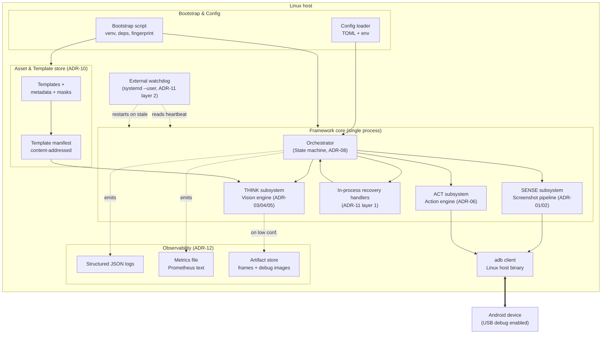
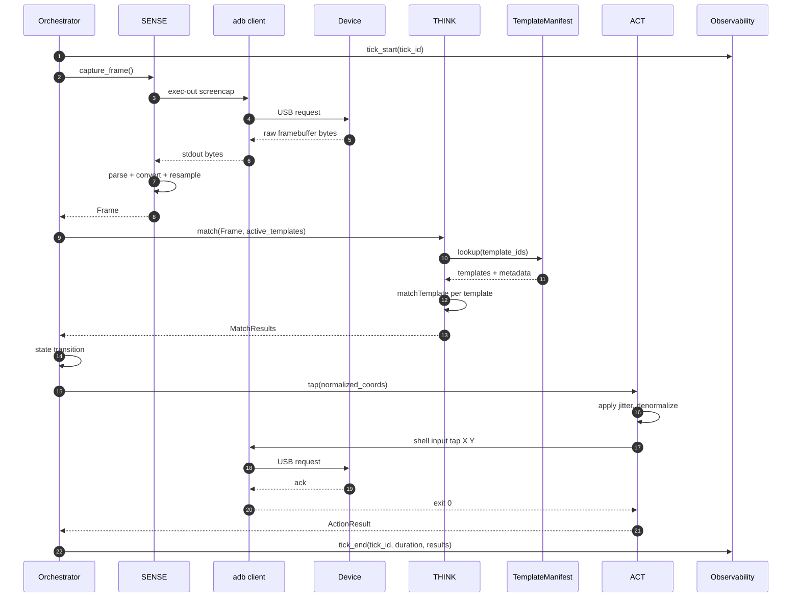
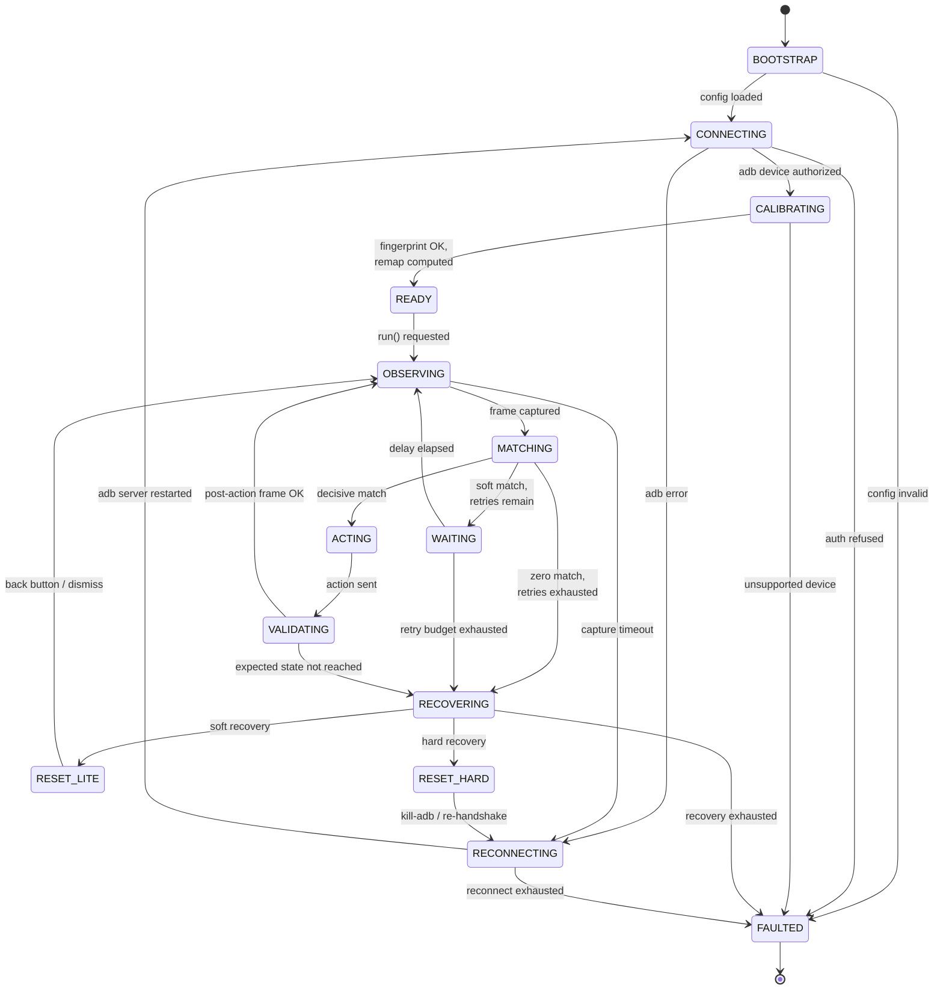
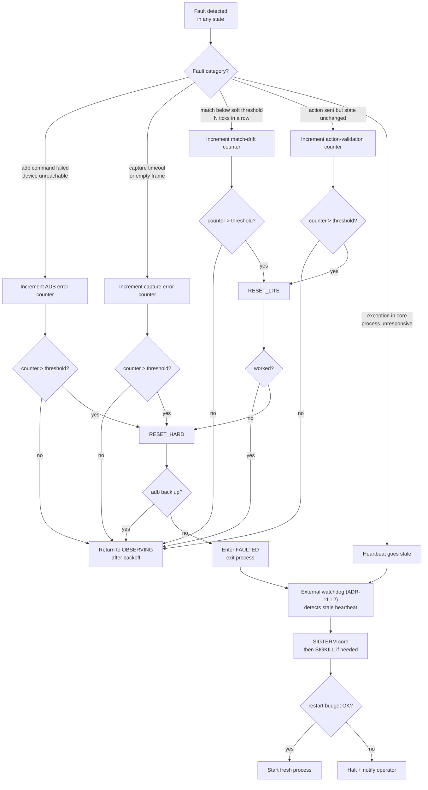
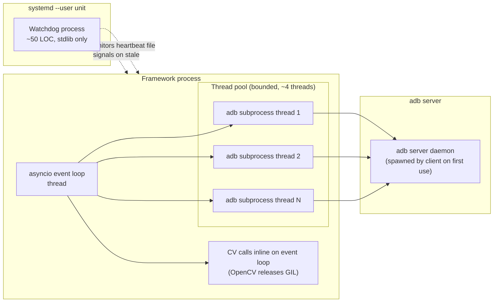
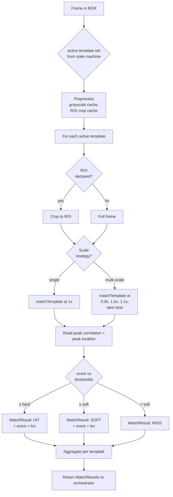
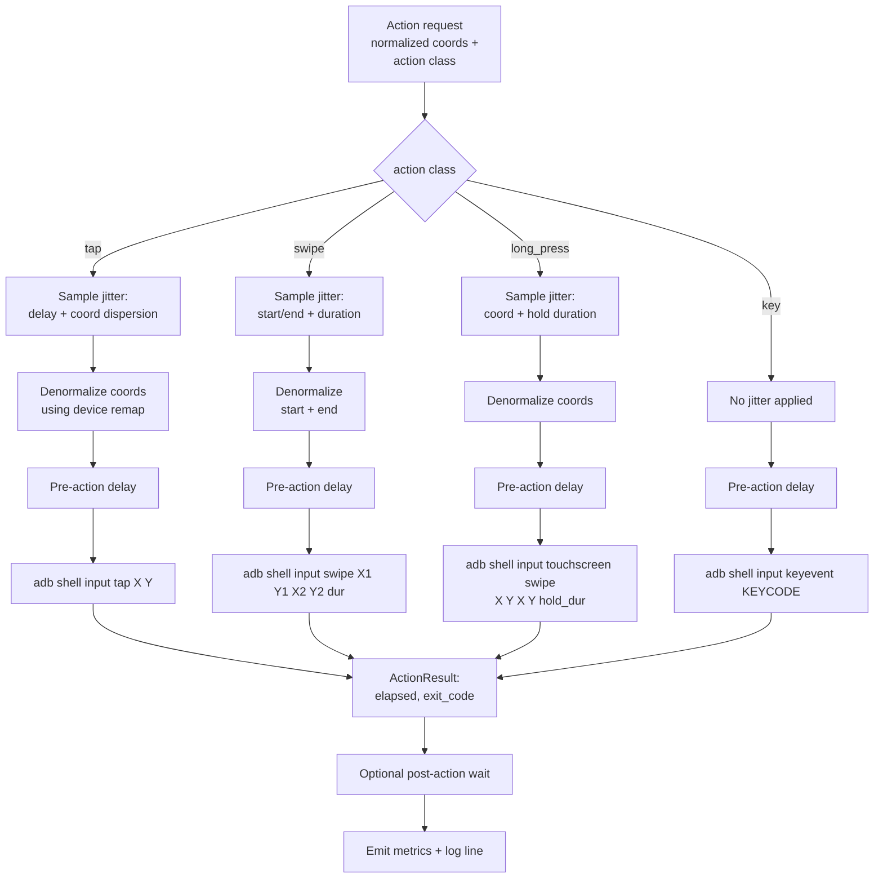
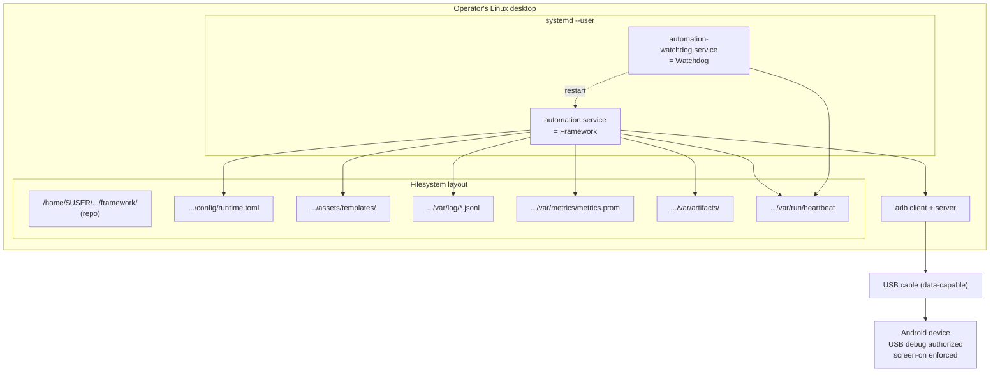

# Architecture Diagrams

> **Document type:** Visual architecture reference
> **System:** Android UI Automation Framework (Python + OpenCV + ADB)
> **Companion documents:** [ADR.md](./ADR.md), [SYSTEM-ROADMAP.md](./SYSTEM-ROADMAP.md), [DESIGN-REVIEW.md](./DESIGN-REVIEW.md)

All diagrams are Mermaid. They are the canonical visualization of the architecture; if a diagram and prose disagree, the prose in `SYSTEM-ROADMAP.md` wins and the diagram is updated to match. Diagrams are intentionally minimal — they encode *structure*, not exhaustive detail.

---

## 1. Component diagram — subsystem boundaries

The framework decomposes into clearly bounded subsystems aligned with SENSE → THINK → ACT, plus the cross-cutting concerns (observability, recovery, configuration, asset management).



**Reading guide.** Solid arrows are data flow on the hot path. Dotted arrows are observability or supervisory side-effects. The Linux host contains everything except the device. The framework core is a single OS process (ADR-07). The watchdog and bootstrap are *outside* the core and supervise it.

---

## 2. Data flow diagram — one tick of the automation loop

A "tick" is one SENSE → THINK → ACT pass. Multiple ticks may occur per second, or seconds may elapse between ticks depending on state (e.g. waiting for an animation).

```mermaid
flowchart LR
    A[Tick start<br/>tick_id assigned] --> B["SENSE: request frame<br/>adb exec-out screencap raw"]
    B --> C[Parse framebuffer header]
    C --> D[Convert RGBA→BGR<br/>NumPy ndarray]
    D --> E["Resample to reference<br/>resolution (ADR-04)"]
    E --> F["THINK: match active<br/>template set"]
    F --> G{Best match<br/>≥ hard threshold?}
    G -->|yes| H[Resolve action plan<br/>via state machine]
    G -->|no| I{Above soft<br/>threshold?}
    I -->|yes| J[Log soft match<br/>emit metric]
    I -->|no| K[Log miss<br/>save artifact]
    J --> H
    K --> L[State machine:<br/>increment retry / timeout]
    H --> M[Apply jitter envelope<br/>ADR-15]
    M --> N["ACT: send adb input<br/>or no-op if observe-only"]
    N --> O[Post-action wait<br/>jittered]
    L --> O
    O --> P[Update metrics<br/>tick duration etc.]
    P --> Q[Tick end<br/>heartbeat written]
```



**Reading guide.** A tick has three exits — clean match, soft match (logged, still acts), miss (recovery escalation in the state machine). The artifact write on miss is the diagnostic surface for debugging silent drift. Heartbeat is written *unconditionally* at tick end so the watchdog distinguishes "framework is doing work" from "framework is hung."

---

## 3. Sequence diagram — typical tick across components

This view shows the same tick as in §2 but from a component-interaction perspective, useful for reasoning about latency budget.



**Latency budget — OLD (pre-Phase-0 estimates) vs NEW (Phase-0
measured, operator hardware):**

| Step | OLD estimate | NEW measured (operator) | Source of cost |
|------|--------------|--------------------------|----------------|
| Capture round trip (steps 3–7) | 80–250 ms | **947 ms (raw, content-deterministic)** / 578–1311 ms (PNG, content-dependent) | USB transport + device-side `screencap` composition |
| Parse + convert + resample (step 8) | 5–15 ms | UE — within range; Phase 2 microbench will confirm | CPU |
| Template matching (step 12) | 5–50 ms × N templates | **2.2 ms (ROI gray) / 7.0 (ROI BGR) / 33.6 (full gray) / 137.9 (full BGR)** per template | CPU |
| Action round trip (steps 17–22) | 80–200 ms | UE — Phase 4 measures; ADB shell overhead alone is 28 ms median (VF) | USB + `input` JVM bootstrap |
| **Total per tick (default templates, ROI discipline)** | **~200–500 ms** typical | **~1.0–1.5 s** typical (UE) | — |

Source: [phase-0-report.md](../phase-0-report.md) §3, §4, §5;
[docs/frozen_nfrs_v1.md](../docs/frozen_nfrs_v1.md). USB 2.0 host
(operator does not have a USB 3.x device).

The OLD column is preserved for historical traceability. The NEW
column is what an implementer or operator should plan against. v1.0
frozen NFRs live in `docs/frozen_nfrs_v1.md`; v1.0 tick rate is
0.5–1 Hz, not the pre-Phase-0 2–5 Hz.

---

## 4. Formal state diagram — orchestrator state machine



**State semantics (summary; full table in `SYSTEM-ROADMAP.md` §11):**

| State | Purpose | Timeout (default) | On timeout |
|-------|---------|-------------------|-----------|
| BOOTSTRAP | load config, verify environment | 10 s | → FAULTED |
| CONNECTING | establish ADB device authorization | 30 s | → RECONNECTING |
| CALIBRATING | device fingerprint, compute remap | 15 s | → FAULTED |
| READY | warm idle, awaiting `run()` | ∞ | — |
| OBSERVING | request a frame | 2 s | → RECONNECTING |
| MATCHING | run THINK on the frame | 500 ms | → RECOVERING |
| WAITING | scheduled delay before next tick | per spec | → OBSERVING |
| ACTING | send one or more ADB inputs | 2 s | → RECOVERING |
| VALIDATING | confirm the action took effect | 2 s | → RECOVERING |
| RECOVERING | choose a recovery path | 5 s | → FAULTED |
| RESET_LITE | back-button / dismiss-modal recovery | 5 s | → OBSERVING (or HARD on fail) |
| RESET_HARD | restart adb + reconnect | 30 s | → FAULTED |
| RECONNECTING | adb server bounce | 30 s | → FAULTED |
| FAULTED | terminal, watchdog will restart process | — | watchdog handles |

`RESET_LITE` and `RESET_HARD` are explicit recovery states rather than transitions because they have their own timeouts and observability footprint; collapsing them into transitions would hide a place where the system spends real time.

---

## 5. Recovery flow — what happens when something goes wrong



**Reading guide.** The recovery system is a *cascade*: light recovery first, escalating only when light recovery doesn't resolve the symptom. Each escalation is gated by a counter so that transient faults (a single dropped frame) do not trigger a full reset. The watchdog (L2) is the floor: if everything else fails, the process dies and is restarted from scratch.

---

## 6. Process & thread topology



**Reading guide.** OpenCV calls run on the event-loop thread because they release the GIL during heavy work. ADB calls are blocking subprocesses, so they run in a thread pool to keep the loop responsive. The adb *server* (started transparently by the adb *client* on first use) is itself a daemon process, owned by no one in particular — recovering it is part of `RESET_HARD`.

---

## 7. Subsystem internal — SENSE pipeline detail

```mermaid
flowchart TB
    REQ[capture_frame request] --> SEL{primary or<br/>fallback mode?}
    SEL -->|primary| EXR["adb exec-out screencap<br/>(raw bytes)"]
    SEL -->|fallback| EXP["adb exec-out screencap -p<br/>(PNG bytes)"]

    EXR --> PARSE[Parse framebuffer header<br/>width, height, format]
    PARSE --> VAL{header valid?}
    VAL -->|no| FB1[Fall back to PNG mode<br/>once; log event]
    FB1 --> EXP
    VAL -->|yes| RGBA[Read pixel bytes]
    RGBA --> CONV[Convert RGBA→BGR<br/>cv2.cvtColor]

    EXP --> DEC[PNG decode<br/>cv2.imdecode]

    CONV --> RES[Resample to ref. resolution<br/>cv2.resize (ADR-04)]
    DEC --> RES

    RES --> FR[Frame ndarray BGR<br/>(H_ref, W_ref, 3)]
    FR --> EMIT[Emit Frame +<br/>capture_duration metric]
```

**Reading guide.** Fallback from primary to PNG is automatic on header parse failure, but it is logged and exposed as a metric so that operators see when fallback is engaging frequently — a signal that the header parser needs an update for a new device profile.

**Phase 0.5 additions.**

- **Mode is configurable.** `sensor.mode = "raw" | "png" | "pull" | "auto"` (see [ADR-01a](../ADR.md#adr-01a--screenshot-pipeline-phase-0-reality-content-dependent-ordering-usb-link-speed-prerequisite)). Default `"raw"` because raw latency is content-deterministic; operators on low-entropy UIs may override to `"png"` for ~450 ms faster captures.
- **Content-dependent ordering.** Raw and PNG modes have measured medians that reverse with screen content. Raw is ~947 ms regardless of content; PNG is ~578 ms on low-entropy screens and ~1311 ms on high-entropy screens. The pipeline diagram is the same; the mode selection knob is in config.
- **USB link-speed prerequisite.** The pipeline assumes the device is connected at ≥ 480 Mbps. Phase 1's `bootstrap.sh` validates this; see [SYSTEM-ROADMAP §5.1.7](../SYSTEM-ROADMAP.md#517-usb-link-speed-validation-phase-05-addition). A USB 1.1 (12 Mbps) link would multiply capture latency by ~40× and is treated as a startup failure.
- **Device-side composition cost.** Raw screencap latency (~947 ms) is decomposed as ~324 ms USB transport (10.4 MB / 260 Mbps) + ~620 ms device-side `screencap` composition. The composition cost is *not* addressable by switching modes; it is the cost of the device's `screencap` binary rendering the framebuffer per call.

---

## 8. Subsystem internal — THINK pipeline detail



**Reading guide.** ROI restriction is the single largest win for matching cost — a 200×200 ROI is 50× cheaper to match than full 1080×1920. Templates that *can* declare a ROI almost always do; the few that cannot (e.g. "find this anywhere on screen") fall back to full-frame.

---

## 9. Subsystem internal — ACT pipeline detail



**Reading guide.** Jitter is applied *before* denormalization so the dispersion is in *normalized* space (proportional to screen size), which is more semantically meaningful than a pixel radius that means different things on different devices.

---

## 10. Deployment topology — the full picture



**Reading guide.** Two systemd user units. The framework writes a heartbeat file. The watchdog reads it. Everything else is filesystem-mediated. There is no network surface in v1 — observability is local-file-only by design.

---

## End of diagrams

When the architecture changes, update both this document and the corresponding ADR. Diagrams that drift from the code are worse than no diagrams.
